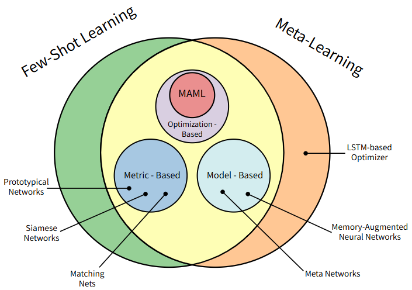
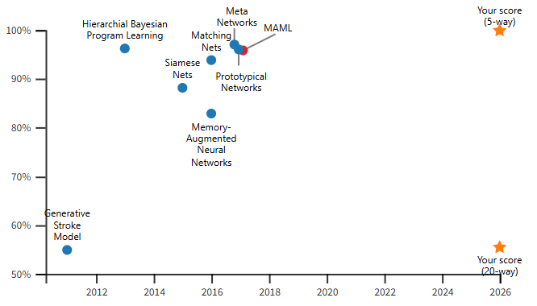

# 工业物联网下基于元学习的边缘设备少样本故障诊断系统

1. 课题背景
   工业设备（如电机、传送带）故障诊断依赖大量标注样本，但工厂中新型设备或罕见故障（如轴承裂纹）样本稀缺（每类仅5-20个），传统AI模型泛化能力差。边缘计算可实时采集设备振动/温度数据，但单边缘节点算力有限；元学习能通过“多任务预训练”实现少样本快速适配。两者结合可解决少样本量、实时诊断和边缘算力约束的工业运维难点问题。

2. 具体内容
   数据层：采集2类工业设备数据（根据能找到数据集进行设计），构建少样本数据集（每故障类5/10/15个样本，共5类故障）。
   模型层：基于MAML（模型无关元学习）设计轻量化诊断模型，元训练阶段用10个故障场景任务预训练，微调阶段用5-10个新设备样本适配，模型训练采用模型压缩等技术减少算力消耗。
   部署层：对模型剪枝（移除40%冗余卷积核）轻量化，部署至工业边缘网关。
   测试层：对比“元学习模型”与“传统CNN”的故障识别准确率有所提高（≥95%）、微调时间（≤10分钟）、边缘推理时延（≤100ms）

3. 基本要求
   掌握元学习算法（如MAML/Reptile）、时序数据处理方法，能用采用推理技术加速边缘推理；
   完成故障诊断原型（含数据采集模块、模型训练脚本、边缘部署程序），罕见故障识别准确率≥92%；
   论文需说明元训练任务设计逻辑、模型压缩前后性能对比、工业场景测试方案。

---

# Pytorch学习路线

1. 读官方文档的入门部分，**对pytorch大体框架（有哪些必须的组成部分）有个感性的认识**。
2. 读论文的代码，目标是逐行读懂，**遇到不懂的地方就查文档、查csdn，这一过程会有很多收获。**
3. 读官方文档的全部章节，加深对pytorch框架的认识，思考框架各个组成部分之间的联系，思考过程中，**遇到不懂的地方就读源代码，这一过程收获最大**。
4. 不适合python初学者，不适合不聪明的人。
5. 不建议用windows系统，很多库对windows极其不友好，比如PIL

# **相关名词：**

1. **M -way- N -shot** 问题（5-way/20-way 1-shot 分类问题）："way"= 类别数；"1-shot"= 每个类别只给 1 个样本学习。N-way指训练数据中有N个类别，K-shot指每个类别下有K个被标记数据。

2. **few-shot learning**：利用很少的被标记数据训练数学模型的过程。

3. **Omniglot dataset**：分类问题数据集，包含 1623 个不同字符，分布在 50 个字母表中，每个字符由 20 个实例代表，每个实例由不同的人绘制，包含大量类但每个类的实例数量有限。被称为MNIST 数据集的“转置”。

4. 

5. **MNIST**：只包含少数类（0 到 9 的数字）且实例众多。

6. **基于优化（Optimistic-Based）**：侧重于优化模型的初始参数，以便在面对新任务时，模型可以通过少量梯度更新快速适应。例：**MAML**。允许自由选择模型架构，不仅适用于传统的监督式学习分类任务，也适用于强化学习。

7. **基于度量（Metric-Based）**：旨在学习一个通用的距离度量函数，使得在潜在（度量）空间中，相似的样本点距离更近，不相似的样本点距离更远。

   1. **Prototypical Networks (原型网络):** 通过计算每个类别样本的平均值（原型）来代表该类别，然后根据查询点到原型的距离进行分类。
   2. **Siamese Networks (孪生网络):** 学习一个区分样本对相似性的度量，用于判断两个输入是否属于同一类别。
   3. **Matching Nets (匹配网络):** 结合了度量学习和注意力机制，直接将查询点与支持集中的所有样本进行比较来进行分类。

8. **基于模型（Model-Based）**：使用一个元学习器模型（如RNN或LSTM）来直接生成另一个任务解决模型的参数或学习过程。是一种神经架构，专门设计以快速适应新任务，且不倾向于过度拟合。

   1. **LSTM-based Optimizer：** 利用LSTM来学习一个更好的优化器，以替代传统的梯度下降法。
      1. **长短期记忆网络（LSTM）**是一种深度学习模型，主要用于处理序列数据，如时间序列、自然语言处理等。
   2. **Memory-Augmented Neural Networks (记忆增强神经网络):** 引入外部记忆模块来存储和检索不同任务的知识，帮助快速学习。
   3. **Meta Networks (元网络):** 能够快速、一次性地将新任务信息合并到其内部表示中。 

9. 

10. 

11. **Meta-Learning（元学习 / learn to learn）**：常见的深度学习模型，目的是学习一个用于预测的数学模型。而元学习面向的不是学习的结果，而是学习的过程。其学习的不是一个直接用于预测的数学模型，而是学习“如何更快更好地学习一个数学模型”。例：一个一个的学单词的发音

    分类：

    - learning good weight initializations：**MAML**，学习一个好的初始化权重，从而在新任务上实现fast adaptation，即在小规模的训练样本上迅速收敛并完成fine-tune。可以理解成提供一个**meta-learner**用于训练base-learner的框架
    - meta-models that generate the parameters of other models
    - learning transferable optimizers

12. **model-agnostic**：绝大多数深度学习模型都可以作为 base-learner 无缝嵌入 MAML 中，而MAML甚至可以用于强化学习中，这就是 MAML 中 model-agnostic 的含义。

13. **task**：模型的训练过程都是围绕 task 展开的，MAML 的输入不再是单纯的数据，而是一个个任务（task）。要正确地理解 task，我们需要了解的相关概念包括

    > **场景案例**：我们需要利用 MAML 训练一个数学模型模型 $M_{fine-tune}$ ，目的是对未知标签的图片做分类，类别包括 $P_1 \sim P_5$（每类 5 个已标注样本用于训练。另外每类有 15 个已标注样本用于测试）。我们的训练数据除了 $P_1 \sim P_5$ 中已标注的样本外，还包括另外 10 个类别的图片 $C_1 \sim C_{10}$（每类 30 个已标注样本），用于帮助训练元学习模型 $M_{meta}$ 。MAML首先利用 $C_1 \sim C_{10}$ 的数据集训练元模型 $M_{meta}$ ，再在 $P_1 \sim P_5$ 的数据集上精调（fine-tune）得到最终的模型 $M_{fine-tune}$ 。 

    1. $\mathcal{D}_{meta-train}$：$C_1 \sim C_{10}$ 包含的共计300个样本，是用于训练 $M_{meta}$ 的数据集
    2. $\mathcal{D}_{meta-test}$：$P_1 \sim P_5$ 包含的共计100个样本，是用于训练和测试 $M_{fine-tune}$ 的数据集
    3. ${support-set}$、${query-set}$：根据 5-way 5-shot 的实验设置，我们在训练 $M_{meta}$ 阶段，从 $C_1 \sim C_{10}$ 中随机取 5 个类别，每个类别再随机取 20 个已标注样本，组成一个 task $ \mathcal{T} $ 。其中的 5 个已标注样本称为 $ \mathcal{T} $ 的 support set ，另外 15 个样本称为 $ \mathcal{T} $ 的 query set ，support set 的大小是固定的 K ，query set 的大小需要人为的进行选择，（上例中选择了15，这是根据 $P_1 \sim P_5$ 中“每类有15个已标注样本用于测试”决定的）。这个 task $ \mathcal{T} $ ，就相当于普通深度学习模型训练过程中的一条训练数据。
    4. ${meta-train classes}$：$C_1 \sim C_{10}$ 
    5. ${meta-test classes}$：$P_1 \sim P_5$ 
    6. task $ \mathcal{T} $  训练定位：相当于普通深度学习模型训练过程中的一条训练数据。那我们肯定要组成一个 batch ，才能做随机梯度下降 SGD* 对不对？所以我们反复在训练数据分布中抽取若干个这样的 task $ \mathcal{T} $ ，组成一个batch。在训练 $M_{fine-tune}$ 阶段，task、support set、query set的含义与训练 $M_{meta}$ 阶段均相同。

14. 

# MAML

## **MAML算法要点：**

1. Obtaining as much prior knowledge about the world as possible. （获取先验知识）
   1. 单样本对无先验知识的模型不足以泛化。
   2. 通过在与目标任务相似的任务上进行预训练，提取任务之间的共性。
   3. 这会得到一个更高层次的元知识（关于任务分布的知识）。
   4. 这种从任务分布学习的能力称为元学习（meta-learning）。
2. Using that to generalize well on only a few samples. （对少数样本进行推广）

## **MAML工作原理：**

### 梯度下降：

1. 机器学习的目标是让模型（比如“区分猫和狗”“迷宫找路”）完成特定任务。要让模型变好，得先定义“**模型有多差**”——这就是“损失函数”。

2. 核心概念：损失函数 $\mathcal{L}_\mathcal{T}(\phi)$

   - $\phi \in \Phi$ ：模型的“参数”（比如神经网络的权重、线性模型的系数），是模型的“内在配置”。 
   - $\mathcal{L}_\mathcal{T}(\phi)$ ：**损失函数**，它衡量“当前参数 $\phi $ 下，模型在任务 $\mathcal{T}$ 上的表现有多差”。数值越大，模型越差；数值越小，模型越好。
   - 依赖数据：损失函数的计算需要“任务对应的数据集”（比如区分猫和狗的图片集）。

   3. 学习目标：最小化损失

      1. 我们的目标是找到**让损失最小的参数 $\phi$**，即：

         - $\min_\phi \mathcal{L}_\mathcal{T}(\phi)$

         这个 $\phi$ 就是“训练好的模型参数”。

   4. 实现方法：怎么找到“让损失最小的 $\phi$ ”？用**梯度下降**，对应公式：

      - $\phi \leftarrow \phi - \alpha \nabla_\phi \mathcal{L}_\mathcal{T}(\phi)$ 
      - $\nabla_\phi \mathcal{L}_\mathcal{T}(\phi)$ ：损失函数对参数 $\phi$ 的**梯度**（可以理解为“损失变化最快的方向”）。 S
      - $\alpha$ ：**学习率**，控制每次调整参数的“步长”（步长太大容易“跳过最优值”，步长太小训练太慢）。
      - 逻辑：梯度是“损失增大最快的方向”，所以我们**沿着梯度的反方向调整参数**，就能让损失“逐步减小”，最终逼近最小值。

3. 可兼容于任何一种采用梯度下降算法的模型。

### 从相似任务中学习（元学习）：

1. 背景：小数据集 + 大量模型参数 → **过拟合**，（模型记住了训练数据，泛化能力差）。
2. 原因：仅用 “当前任务的少量数据” 训练参数，数据量撑不起复杂模型的参数学习。
3. 假设：任务不是孤立的，存在一个 “任务分布 $p(\tau)$ ”（比如 “区分猫和狗”、“区分猫和兔子” 都属于 “动物分类” 任务分布）。
4. 操作：不仅用 “当前任务 $\tau_*$ ” 的数据，还从 “任务分布里的其他相似任务” 中学习，让模型能快速适配新任务。

### MAML 的优化目标：“先元训练，再微调”

学习一个**元参数 $\theta$ **（“跨任务学习的元参数”，作用是**作为新任务微调的“初始值”**——这个初始值是从大量相似任务中学到的**“通用初始化”**，所以新任务只需少量数据微调就能适配。），流程是

**“元训练（学通用初始化）→ 微调（适配新任务）”**：$\min_\theta \mathbb{E}_{\tau \sim p(\tau)} \left[ \mathcal{L}_\tau\left( U_\tau(\theta) \right) \right]$

- $\theta$ ：**元参数**（不是某一个任务的参数，是“所有任务共享的初始参数”）。
- $U_\tau(\theta)$ ：**微调算法**（比如梯度下降）：用“任务 $\tau$  的数据”，把元参数 $\theta$ 调整为“适配任务 $\tau$ 的参数 $U_\tau(\theta)$ ”。
- 期望 $\mathbb{E}_{\tau \sim p(\tau)}$ ：在“任务分布”上取平均，保证元参数 $\theta$ 对**所有相似任务都有通用性**。
- 目标：找到一个元参数 $\theta$ ，使得它经过“每个任务的微调”后，在该任务上的损失 $\mathcal{L}_\tau$ 尽可能小。

### **MAML实现：**

#### Part 1: A simple baseline（简单实现）

1. 原始优化目标是考虑“微调步骤 $U_\tau$ ”：$\min_\theta \mathbb{E}_\tau\left[ \mathcal{L}_\tau\left( U_\tau(\theta) \right) \right]$ ，转变为**预训练基线**（**忽略 $U_\tau$**），简化为：$\min_\theta \mathbb{E}_\tau\left[ \mathcal{L}_\tau(\theta) \right]$ ，回到“标准机器学习”的目标——直接让元参数 $\theta$ 适配“任务分布”的平均损失。

2. 预训练基线的逻辑：用“任务分布的样本均值”代替期望（即**经验风险最小化（ERM）**），对采样的 $n$ 个任务的损失求和，取平均梯度更新 $\theta$ 。对应的梯度更新公式为：

   $\theta \leftarrow \theta - \frac{\alpha}{n} \nabla_\theta \sum_i \mathcal{L}_{\tau_i}(\theta)$ ，$n$ ：采样的任务数。

3. 预训练模型的实现（TensorFlow代码解析）

   ```python
   import torch
   import torch.nn.functional as F
   
   def update_pretrained(model, optimizer, batch):
       """
       执行预训练模型的单步更新。
       参数说明：
       - model: 待训练的PyTorch模型（权重对应元参数θ）
       - optimizer: PyTorch优化器（如Adam、SGD）
       - batch: 采样任务的批量数据，形状为(nTasks, nSamples)
                其中每个样本是 (标签, 输入) 的元组
       """
       # 定义单个任务的损失计算函数
       def task_loss(task_batch):
           y_train, x_train = task_batch  # 拆分单个任务的标签和输入
           # 前向传播计算预测值，MSE损失（对应原代码的mse：损失函数）
           y_pred = model(x_train)
           return F.mse_loss(y_pred, y_train)  # 也可替换为交叉熵等其他损失
       
       # 初始化总损失
       total_loss = torch.tensor(0.0, device=next(model.parameters()).device)
       
       # 遍历批量中的每个任务，计算损失并累加
       for task_batch in batch:
           task_batch_loss = task_loss(task_batch)
           total_loss += task_batch_loss
       
       # 反向传播+参数更新（PyTorch核心流程）
       optimizer.zero_grad()  # 清空之前的梯度
       total_loss.backward()  # 计算损失对模型权重的梯度
       optimizer.step()       # 更新模型权重（元参数θ）
   ```

4. 预训练模型（简化版元学习）的核心缺陷 + MAML 的必要性：预训练模型试图用**一个通用的\( \theta \)** 直接适配所有任务（不做任何微调），自然无法兼顾冲突的任务。

   1. 符号定义：微调步数\( m \)，MAML的原始优化目标是：  \( \min_\theta \mathbb{E}_\tau[\mathcal{L}_\tau(U_\tau(\theta))] \)  

      - 把“微调步骤”显式标注为\( m \)：\( U_\tau^{(m)}(\theta) \)（表示对元参数\( \theta \)做\( m \)步梯度下降微调，得到适配任务\( \tau \)的参数）；对预训练模型的简化，令\( m=0 \)（**完全不做微调**），此时\( U_\tau^{(0)}(\theta) = \theta \)（直接用元参数\( \theta \)预测）。**和少样本元学习 “用少量数据微调初始值” 的核心诉求完全背离。**

   2. 损失空间的关键差异

      | 模型类型          | 损失空间（优化目标）                                    | 本质                           |
      | ----------------- | ------------------------------------------------------- | ------------------------------ |
      | 预训练模型（m=0） | \( \sum_i \mathcal{L}_{\tau_i}(\theta) \)               | 所有任务损失“直接求和”，无微调 |
      | 真实元学习（m>0） | \( \sum_i \mathcal{L}_{\tau_i}(U_\tau^{(m)}(\theta)) \) | 每个任务先微调，再算损失求和   |

   3. 核心结论：预训练模型的缺陷 & MAML的必要性

      1. **预训练模型的核心问题**：
         - 忽略微调步骤\( U_\tau \)（m=0），试图用一个“通用\( \theta \)”直接适配所有任务，但冲突任务（如\( f_1=-f_2 \)）的存在，导致这样的\( \theta \)要么不存在，要么极难找到；
         - 简化后的损失空间和“真实少样本元学习的损失空间”偏差极大，得到的\( \theta \)无法作为“优质初始值”。

      2. **过渡到MAML的逻辑**：
         - 预训练模型仅能作为“基线”（用来对比），而MAML的核心价值是**不忽略微调步骤\( U_\tau \)** ——把“微调后任务损失最小”纳入优化目标，直接优化“适配微调的初始\( \theta \)”；
         - 这也是为什么MAML能解决少样本元学习问题，而预训练模型不行。

#### Part 2: Model-Agnostic Meta-Learning

  \( \sum_i \mathcal{L}_{\tau_i}(U_\tau^{(m)}(\theta)) \) 在优化方式与预训练模型相同 \( \theta \) 之余，在优化策略中，承认微调函数\( U_\tau \)对累积损耗空间的影响。

##### 算法概述：给定当前的**元参数**$θ$，执行了两次梯度下降：

1. MAML**预训练**得到 $M_{meta}$ 的过程：

   - **第一个Require**：$\mathcal{D}_{meta-train}$ 中 **task** 的分布，即反复随机抽取 **task**$\mathcal{T}$，从任务分布 $p(\mathcal{T})$ 中采样若干个任务 $\mathcal{T}_i$ ，形成一个由若干个（e.g., 1000个） $\mathcal{T}$ 组成的 **task** 池，作为MAML的训练集。

   - **第二个Require**： step size，学习率，MAML是基于二重梯度的，每次迭代包括两次参数更新的过程，所以有两个学习率可以调整。（**gradient by gradient**）。

   - 外层循环：可以理解为一轮迭代过程或一个epoch，预训练的过程可以有多个epoch。

   - 相当于 pytorch 中的 DataLoader ，即随机对若干个（e.g., 4个）**task** 进行采样，形成一个 batch 。

   - 4~7 步，第一次梯度更新的过程，可以理解为copy了一个原模型，计算出新的参数，用在第二轮梯度的计算过程中。**针对当前 batch 里的每个任务 task ，先模拟 “用基础参数 $θ$ 微调一次”，得到这个任务专属的 “临时参数 $θ’_i$ ”**，注意这一个过程**在算法中是可以反复执行多次的**。

   - 步骤5：利用batch中的某一个 task 中的 support set ，计算每个参数的梯度。在 N-way K-shot 的设置下，这里的 **support set** 应该有 **NK** 个。计算 “基础参数 $θ$ 在这些数据上的损失” 的梯度。这里的loss计算方法，在回归问题中，就是MSE；在分类问题中，就是**cross-entropy**。

   - 步骤6：第一次梯度的更新，微调一次，得到这个任务的临时参数 $θ’_i$ 。

   - 步骤8：根据第一次梯度更新得到的参数，通过 gradient by gradient，计算第二次梯度更新，梯度更新的不是 $θ’_i$ ，而是原模型 $θ$。不再是分别利用每个 task 的 loss 更新梯度，而是像常见的模型训练过程一样，计算一个 batch 的 loss 总和，对梯度进行随机梯度下降 SGD。换句话说，第一次梯度更新是为了第二次梯度更新，而第二次梯度更新才是为了更新模型参数。这里参与计算的样本，是 task 中的 **query set** 。目的是增强模型在 task 上的泛化能力，避免过拟合 **support set** 。步骤8结束后，模型结束在该batch中的训练，开始回到步骤3，继续采样下一个batch。

2. **fine-tune ** 面对新的**task**，在 $M_{meta}$ 的基础上精调得到 $M_{fine-tune}$ 的过程：

   - 步骤1中，fine-tune 不用再随机初始化参数，而是利用训练好的 $M_{meta}$ 初始化参数。

   - 步骤3中，fine-tune 只需要抽取一个task进行学习，自然也不用形成 batch 。fine-tune 利用这个 task 的support set训练模型，利用 query set 测试模型。实际操作中，我们会在 $\mathcal{D}_{meta-test}$ 上随机抽取许多个task（e.g., 500个），分别微调模型 $M_{meta}$ ，并对最后的测试结果进行平均，从而避免极端情况。

   - fine-tune 没有步骤 8 ，因为 task 的 query set 是用来**测试**模型的，标签对模型是未知的。因此 **fine-tune 过程没有第二次梯度更新，而是直接利用第一次梯度计算的结果更新参数。**


![[meta-learning] 对MAML的深度解析](https://pica.zhimg.com/70/v2-197832f5a287c3cff30dccbc4c6bc58d_1440w.image?source=172ae18b&biz_tag=Post)

##### Pytorch实现：

```python
import torch
import torch.nn.functional as F

def fast_weights_forward(model, weights, x_input):
    """
    手动用微调后的权重执行模型前向传播
    参数：
    - model: PyTorch模型（仅用其层结构和激活函数，权重用传入的weights）
    - weights: 微调后的权重列表 [kernel1, bias1, kernel2, bias2, ...]
    - x_input: 输入张量
    返回：
    - 模型输出（用微调后的权重计算）
    """
    output = x_input
    # 遍历模型的每一层，手动执行前向传播
    for layer_idx in range(len(model.layers)):
        # 从weights中取出当前层的核和偏置（和TF版索引逻辑一致：kernel=2*idx, bias=2*idx+1）
        kernel = weights[layer_idx * 2]
        bias = weights[layer_idx * 2 + 1]
        # 线性计算 + 激活函数（复用原模型的激活函数）
        output = output @ kernel.T  # PyTorch中矩阵乘法需转置核
        output = output + bias
        output = model.layers[layer_idx].activation(output)
    return output

def update_maml(model, optimizer, inner_lr, batch):
    """
    MAML核心更新函数
    参数：
    - model: 待训练的PyTorch模型（nn.Module，权重为元参数θ）
    - optimizer: PyTorch优化器（如Adam，用于更新元参数θ）
    - inner_lr: 内层学习率（微调φᵢ的学习率α）
    - batch: 任务批量数据，每个任务格式为 (y_train, x_train, y_test, x_test)
             整体形状：(n_tasks, )，每个元素是4个张量的元组
    """
    def task_loss(task_batch):
        """处理单个任务的内层微调+测试损失计算"""
        # 拆分单个任务的训练/测试数据
        y_train, x_train, y_test, x_test = task_batch
        
        # ========== 内层微调：计算训练损失梯度，更新得到φᵢ ==========
        # 1. 计算训练损失（保留计算图，用于外层梯度回传）
        y_train_pred = model(x_train)
        train_loss = F.mse_loss(y_train_pred, y_train)  # 替换为F.cross_entropy可处理分类任务
        
        # 2. 计算训练损失对模型权重的梯度（内层梯度）
        grads = torch.autograd.grad(
            train_loss, 
            model.parameters(), 
            create_graph=True  # 关键：保留计算图，让外层能对inner step的梯度求导
        )
        
        # 3. 单步梯度下降得到微调后的权重φᵢ
        fine_tuned_weights = []
        for g, w in zip(grads, model.parameters()):
            fine_tuned_weights.append(w - inner_lr * g)
        
        # ========== 计算微调后在测试集上的损失（用于外层元更新） ==========
        y_test_pred = fast_weights_forward(model, fine_tuned_weights, x_test)
        test_loss = F.mse_loss(y_test_pred, y_test)  # 对应TF版return mse(...)
        
        return test_loss
    
    # ========== 外层元更新：遍历所有任务，计算总损失并更新元参数θ ==========
    # 1. 遍历所有任务，计算每个任务的测试损失
    total_loss = torch.tensor(0.0, device=next(model.parameters()).device)
    for task_batch in batch:
        task_test_loss = task_loss(task_batch)
        total_loss += task_test_loss
    
    # 2. 清空优化器梯度，反向传播计算元梯度，更新元参数θ
    optimizer.zero_grad()
    total_loss.backward()  # 对总损失求导（包含内层微调的计算图）
    optimizer.step()
```

# Reference

1. https://interactive-maml.github.io/#article-title
2. https://zhuanlan.zhihu.com/p/57864886
3. https://zhuanlan.zhihu.com/p/343827171
4. https://zhuanlan.zhihu.com/p/181709693